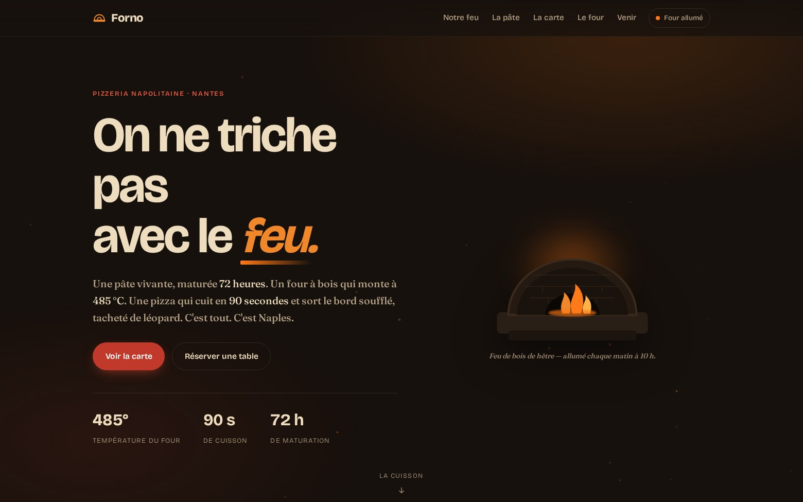

<div align="center">

# 🔥 Forno

### Une pizzeria napolitaine au feu de bois — site vitrine, **zéro dépendance.**


[](https://matgordfr.github.io/site-restaurant/)

<br>

[](https://matgordfr.github.io/site-restaurant/)

</div>

> [!NOTE]
> **Projet démo.** L'établissement, la pizzaïola, le menu et les coordonnées sont **fictifs** — c'est une vitrine de savoir-faire front-end, pas un vrai restaurant. Tout tourne dans le navigateur, sans backend.

---

## ✨ Ce que ça montre

Un **one-pager de restauration** à l'identité forte, pensé pour donner faim — et poussé côté animation, structure et sécurité :

- **Une ambiance « braise »** — fond sombre chaleureux, four à bois vivant (flammes, halo, et une pluie d'**étincelles en canvas** qui s'éteint si `prefers-reduced-motion`).
- **« 72 heures » — la vie de la pâte** — une frise interactive : cliquez une étape (pétrin → pointage → froid → pâtons → four) et le pâton évolue sous vos yeux, métriques à l'appui.
- **Une cuisson interactive** — faites glisser, ou laissez le four faire : la Margherita cuit en 90 s, le bord se tache de « léopard », la mozzarella dore, des braises s'échappent.
- **Une carte filtrable** — *Rosse* / *Bianche* / *Végé*, leaders pointillés, prix en chiffres monospace.
- **La pizzaïola & les avis** — un vrai récit d'artisane (fictif) et trois avis, pour l'humain derrière le four.
- **Un statut « ouvert / fermé »** calculé en direct depuis les horaires, dans la nav et la section *Venir*.

## 🔒 Sécurisé par défaut

Une démo statique n'a ni secret ni backend — mais elle peut quand même être **propre et durcie** :

- **CSP stricte en `<meta>`** — `default-src 'self'`, aucun script/style inline, aucun CDN, aucune requête réseau sortante (`connect-src 'none'`). Vérifiée au rendu réel : **0 violation**.
- **0 `innerHTML`, 0 `eval`** — tout le DOM dynamique est construit via `createElementNS` + `textContent`.
- **`referrer: no-referrer`** et **`rel="noopener noreferrer"`** sur les liens externes.
- Passe les blocs *XSS* et *dépendances* du gate `secure-vibe-app`.

## 🎨 Le craft

- **Identité dérivée du sujet** — palette « feu de bois », rien d'un gabarit générique.
- **Trois polices auto-hébergées** — Bricolage Grotesque (titres) + Fraunces (corps & carte) + JetBrains Mono (chiffres & données, façon tableau de bord). Aucune requête tierce.
- **Graphismes dessinés à la main** — four à briques, pâton, pizza, portrait : tout en SVG. Les étincelles sont générées en canvas.
- **Accessible & responsive** — navigation clavier (frise et filtres pilotables au clavier), focus visible, `prefers-reduced-motion` respecté, du grand écran au mobile **sans débordement** (vérifié à 1440 / 390 / 360 px).

## 🛠️ Stack


Aucun framework, aucune librairie, aucun CDN. Polices comprises, la page reste légère.

## 📁 Structure

```
index.html            → la page (+ CSP meta stricte)
assets/css/forno.css  → design system + identité braise
assets/js/forno.js    → étincelles canvas, frise 72h, filtres carte,
                        cuisson interactive, statut live (0 innerHTML/eval)
assets/fonts/         → Bricolage + Fraunces + JetBrains Mono (auto-hébergées)
```

## 🚀 Lancer en local

```bash
python3 -m http.server 8000
# puis http://localhost:8000
```

## 👤 Auteur

Réalisé par **[MatgordFR](https://github.com/MatgordFR)** — dev indépendant (bots Discord, sites, IA).
🌐 [matgord.com](https://matgord.com) · 🐦 [@matgordfr](https://x.com/matgordfr) · 🎨 [les autres démos](https://matgordfr.github.io/mes-demos-web/)

## 📄 Licence

[ISC](LICENSE) — libre d'usage.
